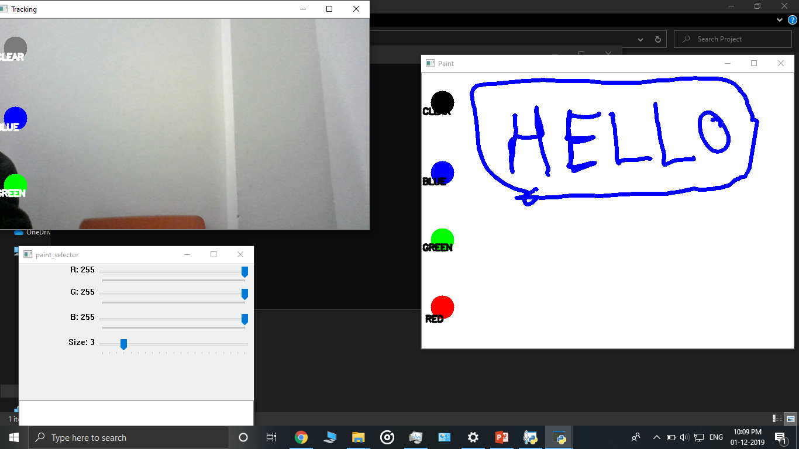

<h1>Gesture-Based-Paint-Application-Mini-Project</h1>
 
<h2>Features:-</h2> 
1)Color Calibration for selecting color for the pointer, keyboard button 'c' 
2)Color picker which can help select all values of RGB from range 0 to 255 
3)Eraser tool 
4)Keyboard button 's' to enable/disable drawing 
5)Brush cursor/pointer is displayed on canvas which helps in better drawing 
6)Keyboard button 'n' and 'm' to increase/decrease brush size 
7)Seperate window to select RGB values and brush size, keyboard button 'l' to fetch values from that window 
8)Keyboard button 'p' to save the image 
9)Clear all option to clear the screen 
10)Press 'q' to quit 
 

    

<h2>Team Members:-</h2> 
1)<a href="https://github.com/masterchef2209">masterchef2209</a> 
2)<a href="https://github.com/saintpopo">saintpopo</a> 
3)<a href="https://github.com/ceejay">ceejay</a> 

